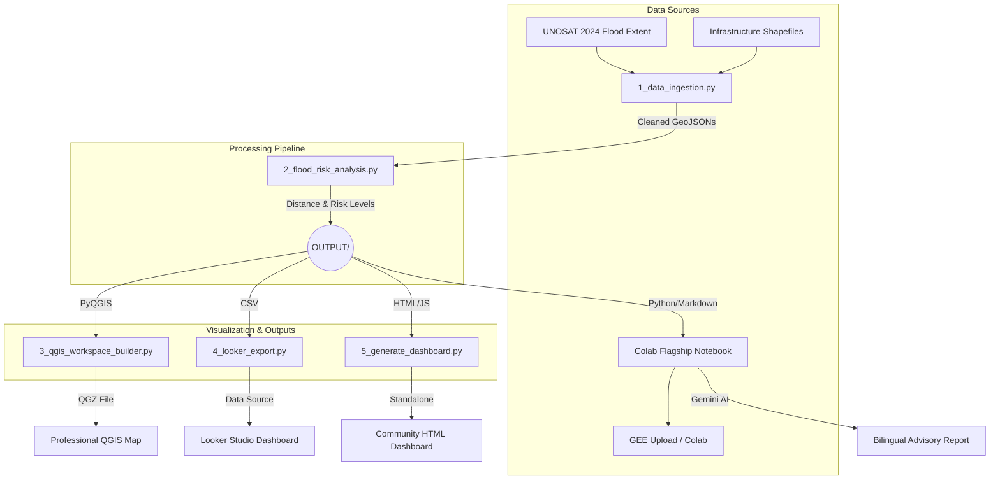

<div align="center">
  
  <h1>🌊 GARISSA COUNTY — EL NIÑO EARLY WARNING SYSTEM</h1>
  <p><strong>Geospatial Intelligence & Agentic AI for Disaster Risk Reduction</strong></p>
  
  [](https://www.python.org)
  [](https://qgis.org)
  [](https://earthengine.google.com/)
  [](https://deepmind.google/technologies/gemini/)
</div>

---

## 📖 Overview

This repository contains the **Garissa Digital Twin**, an automated spatial pipeline designed to predict, visualize, and mitigate the impact of the impending late-2026 Super El Niño.

By fusing **UNOSAT historical flood data**, **Google Earth Engine satellite imagery**, and **Gemini AI**, this system assesses the vulnerability of critical infrastructure (schools, hospitals, boreholes) and generates actionable community alerts.

---

## 🏗️ System Architecture



---

## 🚀 Quick Start

### 1. The Flagship Colab Notebook (Recommended)
For decision-makers, stakeholders, and presentations, use the flagship notebook. It requires no local installation.

[](https://colab.research.google.com/drive/YOUR_COLAB_LINK_HERE) *(Upload `garissa_elnino_flood_risk.ipynb` to Colab)*

**What it does:**
- Interactive Folium maps for Schools, Hospitals, and Water Resources
- Earth Engine CHIRPS rainfall analysis
- Gemini AI auto-generates a bilingual advisory report
- Generates beautiful community dashboard summary cards

### 2. The Offline HTML Dashboard & GEWAS Portal (For Community Sharing)
Need something to share on WhatsApp or view offline? The HTML dashboard is a self-contained interactive map with a modern aesthetic, complete with a 3D floating Garissa County logo.

**New Features (v3.0):**
- **Version History System:** Access historical layouts and prototype stages via the sidebar menu (`v1_prototype.html`, `v2_beta.html`, `index.html`).
- **One-Click AI Report Generation:** Click the new "📄 Generate AI Report" button in the map viewport to stream and render a fully analyzed AI vulnerability report.
- **3D Floating Identity:** Features a beautiful, animated 3D County Government crest that levitates above the map interface.

```bash
# Run the generator
python3 5_generate_dashboard.py
```
*Then double-click `index.html` in your browser.*

### 3. Professional QGIS Workspace
For GIS professionals who need to modify maps or print high-resolution PDFs.

1. Open **QGIS**
2. Open the **Python Console** (`Plugins` -> `Python Console`)
3. Click the **Show Editor** icon (paper/pencil)
4. Open `3_qgis_workspace_builder.py` and run it
5. *Result: A beautifully styled, risk-coded QGIS project is created instantly.*

---

## ⚙️ The Pipeline Scripts

To run the entire system end-to-end, simply execute:
```bash
./run_full_pipeline.sh
```

### Script Breakdown
| Script | Description |
|---|---|
| `1_data_ingestion.py` | Cleans raw shapefiles and standardizes projections to EPSG:4326. |
| `2_flood_risk_analysis.py` | Generates 500m (High), 1.5km (Med), and 3.3km (Low) flood buffers and tags all infrastructure with risk levels and distance-to-flood. |
| `3_qgis_workspace_builder.py` | Automates QGIS to load, group, label, and apply professional risk-based symbology to all layers. |
| `4_looker_export.py` | Aggregates risk data into optimized CSVs for Google Looker Studio. |
| `5_generate_dashboard.py` | Builds a standalone HTML/Leaflet map and Chart.js dashboard. |
| `2_gee_upload_automation.py` | Uploads the risk-assessed outputs to your Earth Engine Assets (`garissadrm`). |

---

## 🔐 Security & API Keys

This project uses `.env` files to protect API keys. **Never commit your `.env` file to GitHub.**

Create a `.env` file in the root directory:
```env
# Google Gemini AI
GOOGLE_API_KEY=your_key_here

# Google Earth Engine
GEE_PROJECT_ID=garissadrm
```

---

## 📊 Outputs & Deliverables

All generated files are saved in the `OUTPUT/` directory:
- `*_Risk_Assessed.geojson`: Raw spatial data with risk tags.
- `flood_risk_summary_statistics.csv`: Summary tables.
- `garissa_flood_risk_dashboard.html`: The offline interactive dashboard.
- `AI_FLOOD_RISK_ADVISORY.md`: The Gemini-generated DRR report.
- `GarissaDRM_ElNino_2026.qgz`: The saved QGIS project.

---
*Built with Google Antigravity IDE for the Garissa County Government & Humanitarian Partners.*
