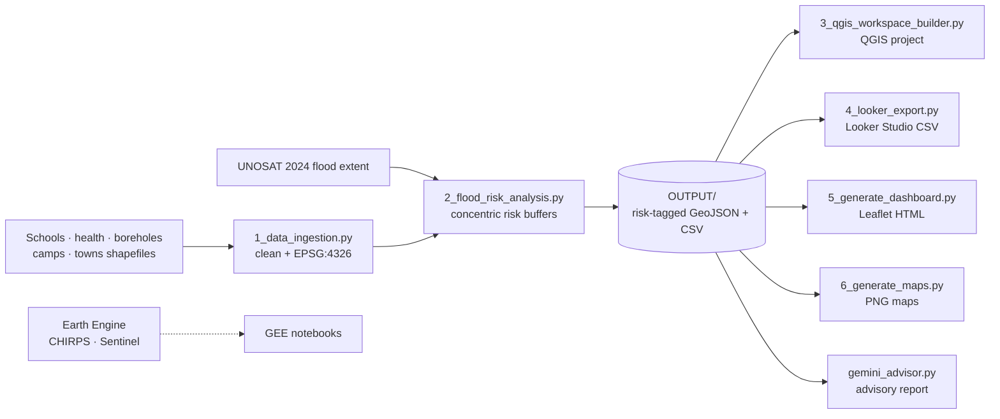

<p align="center">
  
  
  
  
  <a href="https://www.tovutech.com/projects/gewas/"></a>
  <a href="https://jmsmuigai.github.io/Garissa-Early-Warning/"></a>
</p>

## What it is

The **Garissa DRM Portal** is the GIS working repository behind GEWAS (Garissa Early Warning & Adaptation System). It holds the Python, PyQGIS and Earth Engine scripts, QGIS projects and source layers used to map how exposed schools, health facilities, boreholes, camps and towns in Garissa County are to flooding ahead of the expected late-2026 El Niño rains.

It is meant for GIS analysts and county disaster-risk staff. It is a **research and analysis workspace**, not a production system: risk zones are buffers around historical (UNOSAT) flood extents, not hydraulic flood models. The published, maintained web portal now lives in [Garissa-Early-Warning](https://github.com/jmsmuigai/Garissa-Early-Warning).

## What it does

- 🧹 **Cleans and standardises source layers** – `1_data_ingestion.py` reads borehole and infrastructure data, reprojects to EPSG:4326 and keeps only points inside the Garissa County boundary.
- 🌊 **Builds flood-risk zones** – `2_flood_risk_analysis.py` draws non-overlapping concentric bands around the UNOSAT 2024 flood extent (~500 m high, ~1.5 km medium, ~3.3 km low, ~5.5 km extreme), clips them to the county and tags every asset with a risk level and distance to flooding. It also contains a small NumPy neural-network scoring experiment.
- 🗺️ **Styles a QGIS workspace** – `3_qgis_workspace_builder.py` (run inside the QGIS Python console) loads, groups, labels and colours all layers by risk.
- 📊 **Exports for dashboards** – `4_looker_export.py` writes CSVs for Google Looker Studio; `5_generate_dashboard.py` and `generate_all_interactive_maps.py` build standalone Leaflet/Folium HTML maps in `OUTPUT/`.
- 🖼️ **Generates static maps** – `6_generate_maps.py` renders a series of PNG maps and infographics.
- 🛰️ **Earth Engine helpers** – `2_gee_upload_automation.py` and the `GEE_*.ipynb` notebooks upload outputs and analyse CHIRPS rainfall / Sentinel imagery.
- 🤖 **Optional AI advisory** – `gemini_advisor.py` uses the Gemini API (key from `GOOGLE_API_KEY`) to draft an advisory report, saved as `OUTPUT/AI_FLOOD_RISK_ADVISORY.md`. The dashboard's "Generate AI Report" button opens this pre-generated file; it does not call an AI model from the browser.
- ☁️ **Keyless weather** – the dashboard shows a 3-day forecast for Garissa Town from Open-Meteo (no API key).

## How it works


```mermaid
flowchart LR
    A[UNOSAT 2024 flood extent] --> C[2_flood_risk_analysis.py<br/>concentric risk buffers]
    B[Schools · health · boreholes<br/>camps · towns shapefiles] --> I[1_data_ingestion.py<br/>clean + EPSG:4326]
    I --> C
    C --> O[(OUTPUT/<br/>risk-tagged GeoJSON + CSV)]
    O --> Q[3_qgis_workspace_builder.py<br/>QGIS project]
    O --> L[4_looker_export.py<br/>Looker Studio CSV]
    O --> D[5_generate_dashboard.py<br/>Leaflet HTML]
    O --> M[6_generate_maps.py<br/>PNG maps]
    O --> G[gemini_advisor.py<br/>advisory report]
    E[Earth Engine<br/>CHIRPS · Sentinel] -.-> N[GEE notebooks]
```

## Tech stack

| Area | Tools |
|---|---|
| Geoprocessing | Python, GeoPandas, Fiona, Shapely, pyproj, Rasterio, pandas |
| Desktop GIS | QGIS 3.28 LTR + PyQGIS (QGIS projects `*.qgz` included) |
| Remote sensing | Google Earth Engine (`earthengine-api`, `geemap`) |
| Web output | Leaflet, Folium, Chart.js, Kepler.gl |
| Reporting | Jupyter notebooks, Looker Studio exports |
| AI (optional) | Google Gemini (`google-generativeai`) |

## Getting started

```bash
git clone https://github.com/jmsmuigai/garissa-drm-portal.git
cd garissa-drm-portal
python3 -m venv .venv && source .venv/bin/activate
pip install -r requirements.txt
```

Create a `.env` file (git-ignored) only if you need the optional services:

```env
GOOGLE_API_KEY=your_gemini_key        # optional, AI advisory report
GEE_PROJECT_ID=your_earth_engine_project
```

Then:

```bash
./run_full_pipeline.sh          # ingestion → risk analysis → maps → dashboards → Looker export
# or run steps one by one
python3 2_flood_risk_analysis.py
python3 5_generate_dashboard.py  # then open index.html in a browser
```

- **QGIS:** open QGIS → *Plugins → Python Console → Show Editor* → open `3_qgis_workspace_builder.py` → Run.
- **Notebooks:** `garissa_elnino_flood_risk.ipynb` (story notebook) and `GEE_Garissa_Analysis.ipynb` run in Jupyter or Google Colab.
- **Earth Engine:** run `earthengine authenticate` first; see [`GEE_SETUP_GUIDE.md`](GEE_SETUP_GUIDE.md).

> ⚠️ Several helper scripts still contain a hard-coded local path (`/Users/james/...`). Adjust `BASE_DIR` before running them on another machine. Large rasters (`*.tif`, `*.gpkg`) are git-ignored and must be supplied separately.

Further guides in this repo: [`USER_MANUAL.md`](USER_MANUAL.md), [`API_SETUP_GUIDE.md`](API_SETUP_GUIDE.md), [`COLAB_USER_GUIDE.md`](COLAB_USER_GUIDE.md), [`GEOFENCING_GUIDE.md`](GEOFENCING_GUIDE.md), [`QGIS_PLUGINS_GUIDE.md`](QGIS_PLUGINS_GUIDE.md), [`WAY_FORWARD.md`](WAY_FORWARD.md).

### Outputs (`OUTPUT/`)

- `*_risk_assessed.geojson` – assets tagged with risk level and distance to flood
- `flood_risk_summary_statistics.csv`, `looker_combined_risk_data.csv` – summary tables
- `garissa_flood_risk_dashboard.html` and other Leaflet maps
- `AI_FLOOD_RISK_ADVISORY.md` – Gemini-drafted advisory (when generated)
- `GarissaDRM_ElNino_2026.qgz` – QGIS project (repo root)

## Data & privacy

- **Sources:** UNOSAT flood extents, county infrastructure registers (schools, health facilities, boreholes, water pans), Dadaab camp blocks, OSM roads, Kenya SRTM 30 m, LUC2010 land cover, 2019 census population, HDX drought/IDP data, Open-Meteo, CHIRPS via Earth Engine.
- Some values in the scripts (sub-county socio-economic figures, fallback road lines) are hard-coded approximations for when the raw layers are missing — treat outputs as indicative.
- Names and phone numbers were stripped from the WASH and water-point data. Personal data must not be committed; see [SECURITY.md](SECURITY.md).

## Status & roadmap

**Status:** research prototype / analysis workspace, superseded for public use by the [Garissa-Early-Warning](https://github.com/jmsmuigai/Garissa-Early-Warning) portal.

Possible next steps:
- Replace hard-coded paths with a config file and add a pinned environment.
- Replace buffer-based zones with hydrological or hydraulic modelling (e.g. HAND / DEM-based inundation).
- Validate risk zones against observed 2026 flood extents.
- Tidy experimental and one-off `fix_*` / `test_*` scripts.

## Security

See [SECURITY.md](SECURITY.md). Keys go in `.env` (never committed); Earth Engine credentials stay on your machine.

---

<p align="center">
  <b>Built by James M. Mburu · TovuTech Limited</b><br>
  <a href="https://www.tovutech.com">https://www.tovutech.com</a> · <a href="mailto:intelligence@tovutech.com">intelligence@tovutech.com</a><br>
  📖 Case study: <a href="https://www.tovutech.com/projects/gewas/">tovutech.com/projects/gewas</a>
</p>
